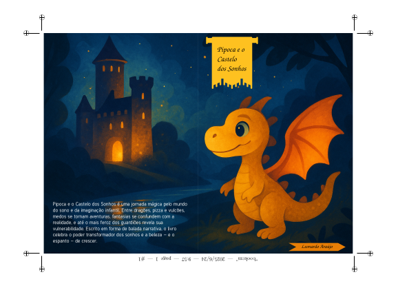

# Pipoca Vai à Escola


**Pipoca e o Castelo dos Sonhos** é um livro infantil ilustrado que acompanha a jornada de um pequeno dinossauro pelo universo dos sonhos e da imaginação. Escrita como uma balada poética, a história segue uma travessia repleta de símbolos e desafios, evocando estruturas arquetípicas que refletem o crescimento, o medo e a descoberta.

## 📒 Sobre o Projeto

Este repositório contém os arquivos do livro, incluindo textos, traduções, imagens e materiais auxiliares usados durante o processo de criação. O projeto foi desenvolvido com o auxílio de ferramentas de IA como ChatGPT e Sora (OpenAI) para geração e refinamento de texto e imagens.

## ✏️ Créditos

- **Texto**: Leonardo Araújo  
- **Ilustrações**: Criadas com o auxílio de Sora (OpenAI)  
- **Assistência criativa**: ChatGPT (OpenAI)

## 💬 Licença

Este livro está licenciado sob os termos da **[Creative Commons - Atribuição-Não Comercial-Sem Derivações 4.0 Internacional (CC BY-NC-ND 4.0)](https://creativecommons.org/licenses/by-nc-nd/4.0/deed.pt-br)**.

Você pode:

- Compartilhar o conteúdo original, desde que dê os devidos créditos;
- Usar para fins não comerciais;
- Não modificar ou criar obras derivadas.

📌 **Uso comercial (como publicação impressa ou venda digital) não é permitido automaticamente por esta licença.**

Se você representa uma editora ou deseja publicar este livro comercialmente, entre em contato com o autor para obter uma **licença específica**, com os devidos termos de publicação e royalties.

## 📚 Objetivo

Este livro foi criado com o intuito de ajudar crianças (e famílias) a enfrentarem com sensibilidade e empatia as mudanças do início da vida escolar.


## 🖨️ Versão para impressão

Para gerar a versão em formato *booklet* (livreto), com marcas de corte para impressão, basta rodar o script:

```bash
./createbooklet.sh
```


### 📦 Dependências necessárias

Certifique-se de que os seguintes pacotes estejam instalados no sistema:

- `pdfjam`
- `pdftk`
- `mutool`
- `pdfseparate` (parte do pacote `poppler-utils`)
- `pdflatex` (incluído em distribuições LaTeX, como `texlive`)

Você pode instalá-los no Ubuntu com:

```bash
sudo apt install pdfjam pdftk mutool poppler-utils texlive
```

### 📄 Arquivos gerados

Ao rodar o script `createbooklet.sh`, os seguintes arquivos PDF serão gerados:

- `booklet_pipoca.pdf`: versão em formato livreto A5 (2 páginas por folha A4, já na ordem para dobra e encadernação).
- `booklet_pipoca_print.pdf`: versão para impressão em folhas A4 (duas páginas lado a lado por folha, sem marcas de corte).
- `booklet_pipoca_print_with_crop_marks.pdf`: versão para impressão profissional, com marcas de corte em A4 (ideal para gráficas).

Essas versões facilitam tanto a leitura doméstica quanto a impressão profissional.



---

> “No, no! The adventures first, explanations take such a dreadful time.”
>
> (Não, não! As aventuras primeiro, explicações levam um tempo terrível.)
>
> — Lewis Carroll, Alice's Adventures in Wonderland


